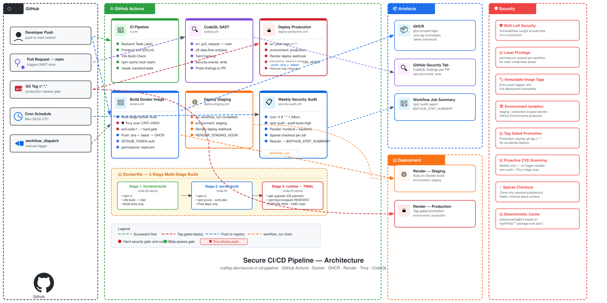

# 🔥 HotTakes — Secure CI/CD Pipeline

> A production-grade CI/CD pipeline built around a lightweight Node.js + React application, demonstrating **real-world DevSecOps practices** with GitHub Actions — automated testing, container security scanning, multi-environment deployments, and scheduled dependency auditing.

---

## 📌 What This Project Is Actually About

The application itself — *HotTakes*, a developer opinion voting board — is intentionally simple and AI-generated. **It exists purely as a deployment target.** The real work here lives in `.github/workflows/`.

This project is a hands-on demonstration of how to wrap any application in a battle-hardened DevSecOps pipeline using nothing but GitHub Actions, Docker, and open-source security tooling.

---

## 🏗️ Pipeline Architecture



---

## 🔄 Workflows — Deep Dive

### 1. `ci.yml` — Continuous Integration

**Trigger:** `workflow_dispatch` (designed to also gate `push` and `pull_request` to `main`)

```
backend-tests ──► frontend-lint + build
```

| Step | Tool | Purpose |
|------|------|---------|
| Checkout | `actions/checkout@v3` | Fetch source |
| Node Setup | `actions/setup-node@v3` | Pin Node 18 |
| **Dependency Cache** | `actions/cache@v4` | Cache `~/.npm` keyed on `package-lock.json` hash — speeds up repeat runs |
| Backend Tests | `jest` + `supertest` | 5 integration tests against live Express routes |
| Frontend Lint | `eslint` (zero warnings) | Enforces code quality with `--max-warnings 0` |
| Frontend Build | `vite build` | Confirms production bundle compiles clean |

**Key design decision:** `frontend-lint` has `needs: backend-tests`, enforcing a strict job ordering — backend must be green before frontend CI begins. Fail fast, fail cheap.

---

### 2. `docker.yml` — Container Build & Security Gate

**Trigger:** `workflow_dispatch`

**Permissions:** `contents: read`, `packages: write` — principle of least privilege to GHCR.

| Step | Detail |
|------|--------|
| Build | `docker build` tagged with `github.sha` for immutable traceability |
| **Trivy Scan** | `aquasecurity/trivy-action@v0.35.0` — scans the built image for OS + library CVEs at `CRITICAL` and `HIGH` severity. `exit-code: 1` means the pipeline **hard-fails and refuses to push** a vulnerable image |
| GHCR Login | Token-based login via `secrets.GITHUB_TOKEN` — no static credentials stored |
| Tag & Push | Pushes both `:<sha>` (immutable, traceable) and `:latest` (canonical) |

**The security gate matters:** Trivy runs *before* the push step. A vulnerable image never reaches the registry. This is the "shift-left" security pattern — catching CVEs at build time, not in production.

---

### 3. `codeql.yml` — Static Application Security Testing (SAST)

**Trigger:** `pull_request` to `main`

**Permissions:**
```yaml
actions: read
contents: read
security-events: write   # Required to post findings to GitHub Security tab
```

Uses **GitHub's native CodeQL engine** to perform semantic code analysis on JavaScript — detecting injection flaws, path traversals, prototype pollution, and more. Results surface directly in the PR and in the repository's Security → Code scanning tab.

**Why this matters:** Unlike linters, CodeQL understands data flow. It can trace a tainted user input across multiple function calls and flag it only if it reaches an unsafe sink — dramatically reducing false positives.

---

### 4. `deploy-staging.yml` — Automated Staging Deployment

**Trigger:** `workflow_run` on `Build Docker Image` → `completed`

```yaml
environment: staging
```

- Uses the **GitHub Environments** system, enabling environment-specific secrets, protection rules, and required reviewers.
- Fires a `curl` POST to `secrets.RENDER_STAGING_HOOK` — a Render deploy webhook — triggering Render to pull the latest image from GHCR and redeploy.
- Staging deployment is **automatic** on every successful Docker build.

---

### 5. `deploy-production.yml` — Tag-Gated Production Deployment

**Trigger:** `push` on tags matching `v*.*.*`

```yaml
environment: production
```

Production deploys are **never automatic on a branch push.** They require an explicit semantic version tag (`git tag v1.2.3 && git push --tags`). This is a deliberate gate — only deliberately released versions reach production.

- GitHub Environment `production` can be further configured with required reviewers, wait timers, or branch restrictions.
- Same Render webhook pattern as staging, but isolated secret: `secrets.RENDER_PRODUCTION_HOOK`.

---

### 6. `security-audit.yml` — Scheduled Vulnerability Audit

**Trigger:** `schedule: cron: "0 9 * * 1"` (Every Monday at 09:00 UTC) + `workflow_dispatch`

This workflow runs **independently of any code push** — it audits the current dependency tree weekly to catch newly disclosed CVEs in existing packages.

**Performance optimizations:**
- **Sparse checkout:** Only clones `backend/` or `frontend/` respectively — not the full repository. Reduces checkout time significantly.
- **Parallel jobs:** `backend-audit` and `frontend-audit` run simultaneously in separate runners.
- **Dependency cache:** `actions/cache@v4` keyed on `package-lock.json` hash.
- **`$GITHUB_STEP_SUMMARY`:** Audit results are piped into the workflow summary page, making findings instantly visible in the GitHub UI without digging through raw logs.

```bash
npm audit --audit-level=high > *-audit-results.txt
cat *-audit-results.txt >> $GITHUB_STEP_SUMMARY
```

---

## 🐳 Dockerfile — Multi-Stage Build

The Dockerfile uses a **3-stage multi-stage build** to produce a minimal, hardened runtime image:

```
Stage 1: frontend-build (node:20-alpine)
  └── npm ci + vite build → produces /dist

Stage 2: server-build (node:20)
  └── npm ci + npm prune --omit=dev → production-only node_modules

Stage 3: runtime (node:20-alpine)  ← Final image
  ├── apk upgrade (OS patches)
  ├── npm + npx + corepack REMOVED from image
  ├── COPY from server-build (node_modules + index.js)
  └── COPY from frontend-build (dist → client/dist)
```

**Security choices made deliberately:**

| Decision | Reason |
|----------|--------|
| `node:20-alpine` runtime base | Minimal attack surface — Alpine has far fewer OS packages than `node:20` (Debian) |
| `npm prune --omit=dev` | Strips all devDependencies — Jest, Supertest, etc. never land in the image |
| Remove `npm`, `npx`, `corepack` | An attacker with RCE cannot run `npm install` inside the container |
| `apk upgrade --no-cache` | Patches all Alpine OS packages at build time |
| Multi-stage build | Build tools (`vite`, compilers) exist only in builder stages, not the final image |

The single `EXPOSE 8000` and `CMD ["node", "index.js"]` keep the runtime surface minimal and auditable.

---

## 🧪 Testing

Backend integration tests use **Jest** and **Supertest**, mounting the Express app directly without spinning up an actual HTTP server:

| Test | Validates |
|------|-----------|
| `GET /api/takes` | Returns 200, array is sorted descending by votes |
| `POST /api/takes` | Creates take, returns 201 + correct body |
| `POST /api/takes` (short text) | Rejects with 400 and error message |
| `POST /api/takes/:id/upvote` | Increments vote count by exactly 1 |
| Vote toggle | Upvote → unvote restores exact original count |

Tests are validated in CI before any Docker build is triggered, ensuring no broken code ever reaches the container layer.

---

## 🔐 Secrets & Credentials Management

| Secret | Scope | Used In |
|--------|-------|---------|
| `GITHUB_TOKEN` | Auto-provisioned by GitHub | GHCR login in `docker.yml`, CodeQL in `codeql.yml` |
| `RENDER_STAGING_HOOK` | GitHub Environment: `staging` | `deploy-staging.yml` |
| `RENDER_PRODUCTION_HOOK` | GitHub Environment: `production` | `deploy-production.yml` |

**Zero static credentials** are stored anywhere in the repository. GitHub's OIDC token handles registry authentication. Environment-scoped secrets ensure production credentials are never accessible to staging jobs.

---

## 🗂️ Repository Structure

```
secure-ci-cd-pipeline/
├── .github/
│   └── workflows/
│       ├── ci.yml                  # Test + Lint + Build gate
│       ├── docker.yml              # Build → Trivy scan → Push to GHCR
│       ├── codeql.yml              # SAST on pull requests
│       ├── deploy-staging.yml      # Auto-deploy staging on Docker build
│       ├── deploy-production.yml   # Tag-gated production deploy
│       └── security-audit.yml      # Weekly scheduled npm audit
├── backend/
│   ├── __tests__/
│   │   └── api.test.js             # Supertest integration tests
│   ├── index.js                    # Express API server
│   └── package.json
├── frontend/
│   ├── App.jsx                     # React UI
│   ├── vite.config.js              # Dev proxy config
│   ├── .env.example                # Documented env vars
│   └── package.json
├── Dockerfile                      # 3-stage multi-stage build
└── .gitignore
```

---

## ⚙️ Tech Stack

| Layer | Technology |
|-------|-----------|
| **CI/CD** | GitHub Actions |
| **Container Registry** | GitHub Container Registry (GHCR) |
| **Container Security** | Trivy (`aquasecurity/trivy-action`) |
| **SAST** | GitHub CodeQL |
| **Dependency Auditing** | `npm audit` |
| **Containerization** | Docker (multi-stage build) |
| **Hosting / CD Target** | Render (webhook-triggered deploys) |
| **Backend** | Node.js 20 + Express 4 |
| **Frontend** | React 18 + Vite 8 |
| **Testing** | Jest + Supertest |

---

## 🧠 DevSecOps Concepts Demonstrated

- **Shift-Left Security** — vulnerabilities caught at build/PR time, not in production
- **Image Immutability** — every push tagged with `github.sha`; `:latest` is always traceable
- **Principle of Least Privilege** — workflow permissions scoped to exactly what each job needs
- **Environment Isolation** — staging and production are separate GitHub Environments with separate secrets
- **Scheduled Proactive Scanning** — CVE discovery doesn't wait for a code change
- **Sparse Checkout** — minimize clone scope for faster, resource-efficient runners
- **Dependency Caching** — `actions/cache@v4` keyed on lock file hash for deterministic cache invalidation
- **Hard Security Gates** — `exit-code: 1` on Trivy means the registry only ever receives clean images
- **SAST via Data-Flow Analysis** — CodeQL understands taint tracking, not just pattern matching
- **Tag-Based Production Promotion** — Git tags as the release mechanism removes accidental deploys

---

## 🚀 Running Locally

```bash
# Backend
cd backend
npm ci
npm run dev          # http://localhost:8000

# Frontend (separate terminal)
cd frontend
cp .env.example .env
npm ci
npm run dev          # http://localhost:5173 (proxies /api → :8000)

# Tests
cd backend && npm test
```

---

## 📄 License

MIT
