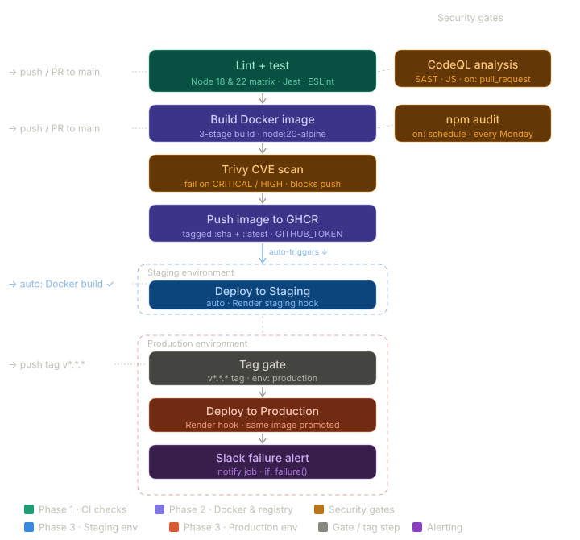

# 🔥 HotTakes — Secure CI/CD Pipeline

> A production-grade CI/CD pipeline built around a lightweight Node.js + React application, demonstrating **real-world DevSecOps practices** with GitHub Actions — reusable workflows, matrix testing, container security scanning, multi-environment deployments, Slack failure alerting, and scheduled dependency auditing.

---

## 📌 What This Project Is Actually About

The application itself — *HotTakes*, a developer opinion voting board — is intentionally simple and AI-generated. **It exists purely as a deployment target.** The real work here lives in `.github/workflows/`.

This project is a hands-on demonstration of how to wrap any application in a battle-hardened DevSecOps pipeline using nothing but GitHub Actions, Docker, and open-source security tooling.

---

## 🏗️ Pipeline Architecture



---

## 🔄 Workflows — Deep Dive

### 1. `ci.yml` + `reusable-test.yml` — Continuous Integration

**Triggers:** `push` to `main`, `pull_request` to `main`, `workflow_dispatch`

`ci.yml` is now a thin **orchestrator** — it contains no test logic itself. Instead it delegates entirely to the reusable workflow:

```yaml
jobs:
  tests:
    uses: ./.github/workflows/reusable-test.yml
```

**Why this matters:** The reusable pattern (`workflow_call`) means the same test suite can be invoked by any other workflow in the repo without copy-pasting. It's the GitHub Actions equivalent of a shared library.

---

#### `reusable-test.yml` — The Reusable Test Workflow

**Triggers:** `workflow_call` (invoked by `ci.yml`), `workflow_dispatch` (can also be run standalone)

This is where the actual CI logic lives. Both `backend-test` and `frontend-test` jobs use a **Node.js version matrix**, running the full suite against **two Node versions in parallel**:

```yaml
strategy:
  matrix:
    node-version: [18, 22]
```

| Job | What it does |
| --- | --- |
| `backend-test` | Sparse-checks out `backend/` only, installs deps, runs `npm test` (Jest + Supertest) on Node 18 **and** Node 22 simultaneously |
| `frontend-test` | Sparse-checks out `frontend/` only, installs deps, runs `npm run lint` (ESLint, zero warnings) on Node 18 **and** Node 22 simultaneously |

**Key design decisions:**

- **Matrix testing** — catching regressions across Node LTS versions before they hit production. 4 total runner jobs (2 jobs × 2 Node versions) are spawned per CI run.
- **Sparse checkout per job** — `backend-test` only clones `backend/`, `frontend-test` only clones `frontend/`. Reduces checkout time and avoids downloading irrelevant code.
- **`actions/setup-node@v4`** — upgraded from v3, uses the modern `node-version` input from the matrix.
- **Dependency cache** — `actions/cache@v4` keyed separately per `backend/package-lock.json` and `frontend/package-lock.json`.

---

### 2. `docker.yml` — Container Build & Security Gate

**Trigger:** `push` to `main`, `pull_request` to `main` — (`workflow_dispatch` retained for manual testing only)

**Permissions:** `contents: read`, `packages: write` — principle of least privilege to GHCR.

| Step | Detail |
| --- | --- |
| Build | `docker build` tagged with `github.sha` for immutable traceability |
| **Trivy Scan** | `aquasecurity/trivy-action@v0.35.0` — scans the built image for OS + library CVEs at `CRITICAL` and `HIGH` severity. `exit-code: 1` means the pipeline **hard-fails and refuses to push** a vulnerable image |
| GHCR Login | Token-based login via `secrets.GITHUB_TOKEN` — no static credentials stored |
| Tag & Push | Pushes both `:<sha>` (immutable, traceable) and `:latest` (canonical) |

**The security gate matters:** Trivy runs *before* the push step. A vulnerable image never reaches the registry. This is the "shift-left" security pattern — catching CVEs at build time, not in production.

---

### 3. `codeql.yml` — Static Application Security Testing (SAST)

**Trigger:** `pull_request` to `main`

**Permissions:**

```yaml
actions: read
contents: read
security-events: write   # Required to post findings to GitHub Security tab
```

Uses **GitHub's native CodeQL engine** to perform semantic code analysis on JavaScript — detecting injection flaws, path traversals, prototype pollution, and more. Results surface directly in the PR and in the repository's Security → Code scanning tab.

**Why this matters:** Unlike linters, CodeQL understands data flow. It can trace a tainted user input across multiple function calls and flag it only if it reaches an unsafe sink — dramatically reducing false positives.

---

### 4. `deploy-staging.yml` — Automated Staging Deployment

**Trigger:** `workflow_run` on `Build Docker Image` → `completed`

```yaml
environment: staging
```

- Uses the **GitHub Environments** system, enabling environment-specific secrets, protection rules, and required reviewers.
- Fires a `curl` POST to `secrets.RENDER_STAGING_HOOK` — a Render deploy webhook — triggering Render to pull the latest image from GHCR and redeploy.
- Staging deployment is **automatic** on every successful Docker build.

---

### 5. `deploy-production.yml` — Tag-Gated Production Deploy + Slack Failure Alert

**Trigger:** `push` on tags matching `v*.*.*`

```yaml
environment: production
```

Production deploys are **never automatic on a branch push.** They require an explicit semantic version tag (`git tag v1.2.3 && git push --tags`). This is a deliberate gate — only deliberately released versions reach production.

This workflow now has **two jobs**:

```text
deploy ──► notify (only on failure())
```

| Job | Condition | What it does |
| --- | --- | --- |
| `deploy` | always | POSTs to `secrets.RENDER_PRODUCTION_HOOK` to trigger Render redeploy |
| `notify` | `needs: deploy` + `if: failure()` | Sends a **Slack alert** via `secrets.SLACK_WEBHOOK_URL` with repo name and failing tag |

**The Slack notification payload:**

```json
{"text": "Deploy failed for <repo> on tag <tag>"}
```

**Why this matters:** Silent production deploy failures are dangerous. The `notify` job guarantees that if Render rejects the deploy for any reason, the on-call engineer gets pinged immediately on Slack — without needing to poll GitHub Actions manually.

---

### 6. `security-audit.yml` — Scheduled Vulnerability Audit

**Trigger:** `schedule: cron: "0 9 * * 1"` (Every Monday at 09:00 UTC) + `workflow_dispatch`

This workflow runs **independently of any code push** — it audits the current dependency tree weekly to catch newly disclosed CVEs in existing packages.

**Performance optimizations:**

- **Sparse checkout:** Only clones `backend/` or `frontend/` respectively — not the full repository.
- **Parallel jobs:** `backend-audit` and `frontend-audit` run simultaneously in separate runners.
- **Dependency cache:** `actions/cache@v4` keyed on `package-lock.json` hash.
- **`$GITHUB_STEP_SUMMARY`:** Audit results are piped into the workflow summary page, making findings instantly visible in the GitHub UI without digging through raw logs.

```bash
npm audit --audit-level=high > *-audit-results.txt
cat *-audit-results.txt >> $GITHUB_STEP_SUMMARY
```

---

## 🐳 Dockerfile — Multi-Stage Build

The Dockerfile uses a **3-stage multi-stage build** to produce a minimal, hardened runtime image:

```text
Stage 1: frontend-build (node:20-alpine)
  └── npm ci + vite build → produces /dist

Stage 2: server-build (node:20)
  └── npm ci + npm prune --omit=dev → production-only node_modules

Stage 3: runtime (node:20-alpine)  ← Final image
  ├── apk upgrade (OS patches)
  ├── npm + npx + corepack REMOVED from image
  ├── COPY from server-build (node_modules + index.js)
  └── COPY from frontend-build (dist → client/dist)
```

**Security choices made deliberately:**

| Decision | Reason |
| --- | --- |
| `node:20-alpine` runtime base | Minimal attack surface — Alpine has far fewer OS packages than `node:20` (Debian) |
| `npm prune --omit=dev` | Strips all devDependencies — Jest, Supertest, etc. never land in the image |
| Remove `npm`, `npx`, `corepack` | An attacker with RCE cannot run `npm install` inside the container |
| `apk upgrade --no-cache` | Patches all Alpine OS packages at build time |
| Multi-stage build | Build tools (`vite`, compilers) exist only in builder stages, not the final image |

The single `EXPOSE 8000` and `CMD ["node", "index.js"]` keep the runtime surface minimal and auditable.

---

## 🧪 Testing

Backend integration tests use **Jest** and **Supertest**, mounting the Express app directly without spinning up an actual HTTP server. Tests run across a **Node 18 × Node 22 matrix** in CI:

| Test | Validates |
| --- | --- |
| `GET /api/takes` | Returns 200, array is sorted descending by votes |
| `POST /api/takes` | Creates take, returns 201 + correct body |
| `POST /api/takes` (short text) | Rejects with 400 and error message |
| `POST /api/takes/:id/upvote` | Increments vote count by exactly 1 |
| Vote toggle | Upvote → unvote restores exact original count |

Tests are validated in CI before any Docker build is triggered, ensuring no broken code ever reaches the container layer.

---

## 🔐 Secrets & Credentials Management

| Secret | Scope | Used In |
| --- | --- | --- |
| `GITHUB_TOKEN` | Auto-provisioned by GitHub | GHCR login in `docker.yml`, CodeQL in `codeql.yml` |
| `RENDER_STAGING_HOOK` | GitHub Environment: `staging` | `deploy-staging.yml` |
| `RENDER_PRODUCTION_HOOK` | GitHub Environment: `production` | `deploy-production.yml` |
| `SLACK_WEBHOOK_URL` | Repository secret | `deploy-production.yml` — failure alert |

**Zero static credentials** are stored anywhere in the repository. GitHub's OIDC token handles registry authentication. Environment-scoped secrets ensure production credentials are never accessible to staging jobs.

---

## 🗂️ Repository Structure

```text
secure-ci-cd-pipeline/
├── .github/
│   └── workflows/
│       ├── ci.yml                  # Orchestrator — delegates to reusable-test.yml
│       ├── reusable-test.yml       # Matrix test runner (Node 18 + 22, sparse checkout)
│       ├── docker.yml              # Build → Trivy scan → Push to GHCR
│       ├── codeql.yml              # SAST on pull requests
│       ├── deploy-staging.yml      # Auto-deploy staging on Docker build
│       ├── deploy-production.yml   # Tag-gated production deploy + Slack failure alert
│       └── security-audit.yml      # Weekly scheduled npm audit
├── backend/
│   ├── __tests__/
│   │   └── api.test.js             # Supertest integration tests
│   ├── index.js                    # Express API server
│   └── package.json
├── frontend/
│   ├── App.jsx                     # React UI
│   ├── vite.config.js              # Dev proxy config
│   ├── .env.example                # Documented env vars
│   └── package.json
├── docs/
│   └── cicd-architecture.svg       # Architecture diagram
├── Dockerfile                      # 3-stage multi-stage build
└── .gitignore
```

---

## ⚙️ Tech Stack

| Layer | Technology |
| --- | --- |
| **CI/CD** | GitHub Actions |
| **Reusable Workflows** | `workflow_call` — shared test logic across workflows |
| **Matrix Testing** | Node.js 18 + 22 tested in parallel |
| **Container Registry** | GitHub Container Registry (GHCR) |
| **Container Security** | Trivy (`aquasecurity/trivy-action`) |
| **SAST** | GitHub CodeQL |
| **Dependency Auditing** | `npm audit` |
| **Containerization** | Docker (multi-stage build) |
| **Hosting / CD Target** | Render (webhook-triggered deploys) |
| **Alerting** | Slack (Incoming Webhooks — production failure notifications) |
| **Backend** | Node.js 20 + Express 4 |
| **Frontend** | React 18 + Vite 8 |
| **Testing** | Jest + Supertest |

---

## 🧠 DevSecOps Concepts Demonstrated

- **Reusable Workflows** — `workflow_call` decouples test logic from trigger logic; DRY principle applied to CI
- **Matrix Testing** — simultaneous runs across Node 18 and Node 22 catch version-specific regressions automatically
- **Shift-Left Security** — vulnerabilities caught at build/PR time, not in production
- **Image Immutability** — every push tagged with `github.sha`; `:latest` is always traceable
- **Principle of Least Privilege** — workflow permissions scoped to exactly what each job needs
- **Environment Isolation** — staging and production are separate GitHub Environments with separate secrets
- **Scheduled Proactive Scanning** — CVE discovery doesn't wait for a code change
- **Sparse Checkout** — minimise clone scope per job for faster, resource-efficient runners
- **Dependency Caching** — `actions/cache@v4` keyed on lock file hash for deterministic cache invalidation
- **Hard Security Gates** — `exit-code: 1` on Trivy means the registry only ever receives clean images
- **SAST via Data-Flow Analysis** — CodeQL understands taint tracking, not just pattern matching
- **Tag-Based Production Promotion** — Git tags as the release mechanism removes accidental deploys
- **Failure Alerting** — Slack webhook on production deploy failure; no silent outages

---

## 🚀 Running Locally

```bash
# Backend
cd backend
npm ci
npm run dev          # http://localhost:8000

# Frontend (separate terminal)
cd frontend
cp .env.example .env
npm ci
npm run dev          # http://localhost:5173 (proxies /api → :8000)

# Tests
cd backend && npm test
```

---

## 📄 License

MIT
